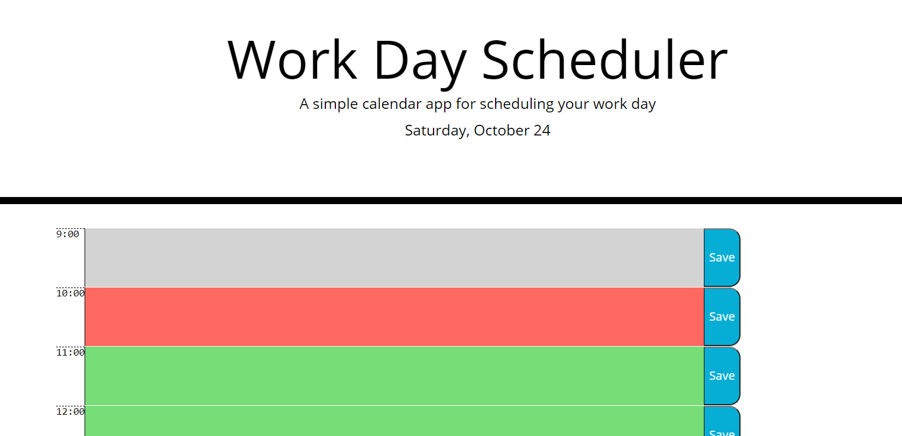

# Day Planner

This is a day planner that will allow you to enter in your tasks or appointments for the day from 9AM - 5PM. It will save those items if the browser is closed or refreshed. It will automatically change the date so you always know what day of the week it is. If you are past an appointment, the time block will turn gray, if it is the current time, the time block will turn red, and if it is in the future it will be green.

The link to this day planner is:
https://scmcphee9.github.io/Day_Planner/

